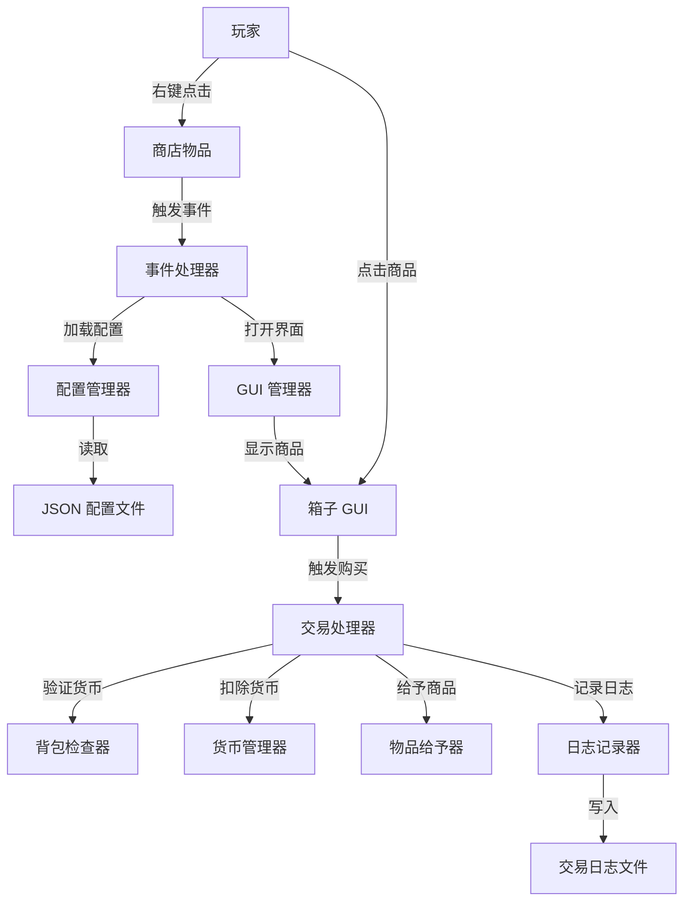
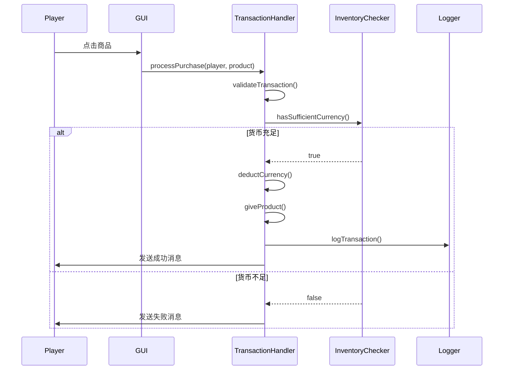

# 设计文档

## 概述

本设计文档描述了基于 Minecraft 1.20.1 Forge + KubeJS 6 的商店系统实现方案。系统完全使用 KubeJS 脚本实现，无需额外的 Forge Mod。核心架构包括：配置管理模块、GUI 渲染模块、交易处理模块和日志记录模块。

系统采用事件驱动架构，通过 KubeJS 的事件系统监听玩家交互，使用 JSON 配置文件管理商品和货币数据，支持热加载以实现无缝配置更新。

## 架构

### 整体架构



### 模块划分

1. **配置管理模块 (ConfigManager)**
   - 负责加载和解析 JSON 配置文件
   - 提供配置热加载功能
   - 缓存配置数据以提高性能

2. **GUI 管理模块 (GUIManager)**
   - 创建和管理箱子界面
   - 渲染商品图标和信息
   - 处理翻页逻辑

3. **交易处理模块 (TransactionHandler)**
   - 验证交易条件
   - 执行货币扣除和物品给予
   - 处理交易回滚

4. **日志记录模块 (Logger)**
   - 记录所有交易详情
   - 管理日志文件分割
   - 提供日志查询接口

## 组件和接口

### 1. 配置管理器 (ConfigManager)

**职责**: 管理所有配置文件的加载、解析和缓存

**接口**:
```javascript
class ConfigManager {
  // 加载所有配置文件
  loadConfigs()
  
  // 重新加载配置（热加载）
  reloadConfigs()
  
  // 获取商品列表
  getProducts()
  
  // 获取货币定义
  getCurrencies()
  
  // 获取商店物品配置
  getShopItemConfig()
  
  // 验证配置文件格式
  validateConfig(config)
}
```

**配置文件路径**:
- 商品配置: `kubejs/config/shop/products.json`
- 货币配置: `kubejs/config/shop/currencies.json`
- 商店物品配置: `kubejs/config/shop/shop_item.json`
- 消息配置: `kubejs/config/shop/messages.json`

### 2. 事件处理器 (EventHandler)

**职责**: 监听和处理玩家交互事件

**接口**:
```javascript
class EventHandler {
  // 注册右键点击事件
  registerRightClickEvent()
  
  // 注册 GUI 点击事件
  registerGUIClickEvent()
  
  // 检查物品是否为商店物品
  isShopItem(item)
  
  // 处理商店物品使用
  handleShopItemUse(player, item)
}
```

**事件绑定**:
- `ItemEvents.rightClicked`: 检测商店物品使用
- `BlockEvents.rightClicked`: 可选的方块交互支持
- 自定义 GUI 点击事件处理

### 3. GUI 管理器 (GUIManager)

**职责**: 创建和管理商店界面

**接口**:
```javascript
class GUIManager {
  // 打开商店 GUI
  openShopGUI(player, page)
  
  // 渲染商品页面
  renderProductPage(products, page, pageSize)
  
  // 创建商品图标
  createProductIcon(product)
  
  // 添加翻页按钮
  addNavigationButtons(gui, currentPage, totalPages)
  
  // 添加关闭按钮
  addCloseButton(gui)
}
```

**GUI 布局** (以 54 格箱子为例):
```
第 0-44 格: 商品展示区 (45 个商品位)
第 45-48 格: 装饰/填充
第 49 格: 上一页按钮
第 50 格: 关闭按钮
第 51 格: 下一页按钮
第 52-53 格: 装饰/填充
```

### 4. 交易处理器 (TransactionHandler)

**职责**: 处理购买交易的完整流程

**接口**:
```javascript
class TransactionHandler {
  // 处理购买请求
  processPurchase(player, product)
  
  // 验证交易条件
  validateTransaction(player, product)
  
  // 检查货币是否充足
  hasSufficientCurrency(player, currency, amount)
  
  // 扣除货币
  deductCurrency(player, currency, amount)
  
  // 给予商品
  giveProduct(player, product)
  
  // 回滚交易
  rollbackTransaction(player, currency, amount)
  
  // 发送交易消息
  sendTransactionMessage(player, success, message)
}
```

**交易流程**:


### 5. 货币管理器 (CurrencyManager)

**职责**: 处理货币相关操作

**接口**:
```javascript
class CurrencyManager {
  // 计算所需货币数量
  calculateRequiredAmount(price, currencyValue)
  
  // 统计玩家拥有的货币数量
  countCurrency(player, currencyId)
  
  // 从背包中移除货币
  removeCurrency(player, currencyId, amount)
  
  // 验证货币 NBT 标签（可选）
  validateCurrencyNBT(item, expectedNBT)
}
```

### 6. 日志记录器 (Logger)

**职责**: 记录所有交易和系统事件

**接口**:
```javascript
class Logger {
  // 记录交易
  logTransaction(player, product, currency, amount, success)
  
  // 记录错误
  logError(message, error)
  
  // 记录配置重载
  logConfigReload(success)
  
  // 获取日志文件路径
  getLogFilePath()
  
  // 检查并分割日志文件
  checkAndRotateLog()
}
```

**日志格式** (JSON Lines):
```json
{
  "timestamp": "2024-01-15T10:30:45.123Z",
  "type": "transaction",
  "player": "PlayerName",
  "player_uuid": "uuid-string",
  "product": {
    "id": "minecraft:white_concrete",
    "count": 1
  },
  "currency": {
    "id": "minecraft:cobblestone",
    "count": 64
  },
  "success": true
}
```

## 数据模型

### 商品配置 (products.json)

```json
{
  "products": [
    {
      "id": "product_001",
      "item": {
        "id": "minecraft:white_concrete",
        "count": 1,
        "nbt": {}
      },
      "price": {
        "currency": "cobblestone",
        "amount": 64
      },
      "display": {
        "name": "白色混凝土",
        "lore": [
          "§7使用 64 个圆石购买",
          "§a点击购买"
        ]
      },
      "enabled": true
    }
  ]
}
```

**字段说明**:
- `id`: 商品唯一标识符
- `item.id`: Minecraft 物品 ID
- `item.count`: 购买数量
- `item.nbt`: 可选的 NBT 数据
- `price.currency`: 货币 ID（引用 currencies.json）
- `price.amount`: 基础价格（将根据货币价值计算实际数量）
- `display.name`: 显示名称
- `display.lore`: 描述文本数组
- `enabled`: 是否启用该商品

### 货币配置 (currencies.json)

```json
{
  "currencies": [
    {
      "id": "cobblestone",
      "item": {
        "id": "minecraft:cobblestone",
        "nbt": null
      },
      "display_name": "圆石",
      "value": 1,
      "enabled": true
    },
    {
      "id": "emerald",
      "item": {
        "id": "minecraft:emerald",
        "nbt": null
      },
      "display_name": "绿宝石",
      "value": 64,
      "enabled": true
    }
  ]
}
```

**字段说明**:
- `id`: 货币唯一标识符
- `item.id`: Minecraft 物品 ID
- `item.nbt`: 可选的 NBT 匹配规则
- `display_name`: 显示名称
- `value`: 相对价值（基础单位为 1）
- `enabled`: 是否启用该货币

**货币价值计算示例**:
- 如果商品价格为 64（基础单位），货币价值为 1（圆石），则需要 64 个圆石
- 如果商品价格为 64（基础单位），货币价值为 64（绿宝石），则需要 1 个绿宝石

### 商店物品配置 (shop_item.json)

```json
{
  "shop_item": {
    "id": "minecraft:nether_star",
    "nbt": {
      "shop_item": true
    },
    "display": {
      "name": "§6§l商店",
      "lore": [
        "§7右键打开商店",
        "§e购买各种物品"
      ]
    }
  }
}
```

### 消息配置 (messages.json)

```json
{
  "messages": {
    "shop_opened": "§a商店已打开",
    "purchase_success": "§a成功购买 {product_name}！",
    "purchase_failed": "§c购买失败！",
    "insufficient_currency": "§c货币不足！需要 {required} 个 {currency_name}，你只有 {current} 个",
    "inventory_full": "§c背包已满！请清理背包后再试",
    "config_reloaded": "§a配置已重新加载",
    "config_error": "§c配置加载失败，请检查配置文件格式"
  }
}
```

## 正确性属性

*属性是一个特征或行为，应该在系统的所有有效执行中保持为真——本质上是关于系统应该做什么的形式化陈述。属性作为人类可读规范和机器可验证正确性保证之间的桥梁。*


### 属性 1: 配置热加载一致性

*对于任何*有效的配置文件修改，当系统重新加载配置后，后续操作应该使用新的配置数据而不是旧的配置数据

**验证: 需求 1.1, 1.2**

### 属性 2: 无效配置回退

*对于任何*无效的配置文件（格式错误的 JSON），系统应该保持使用上一次有效的配置，并记录错误信息到日志

**验证: 需求 1.3**

### 属性 3: 商店物品识别

*对于任何*物品，当且仅当该物品包含 NBT 标签 `{shop_item: true}` 时，右键点击应该打开商店 GUI

**验证: 需求 2.1, 2.2, 2.3**

### 属性 4: 配置解析完整性

*对于任何*有效的 JSON 配置文件，系统应该能够正确解析并加载所有商品和货币定义，且每个定义都包含所有必需字段

**验证: 需求 4.1, 4.2, 4.4, 4.5**

### 属性 5: GUI 商品渲染完整性

*对于任何*启用的商品列表，商店 GUI 应该显示所有商品，且每个商品都包含物品图标、名称、价格和货币类型信息

**验证: 需求 3.1, 3.3**

### 属性 6: 分页逻辑正确性

*对于任何*商品列表，当商品数量超过单页容量（45 个）时，GUI 应该显示翻页按钮，且所有商品都可以通过翻页访问

**验证: 需求 3.4**

### 属性 7: 货币价值计算正确性

*对于任何*商品价格和货币类型组合，系统计算的所需货币数量应该等于 `商品基础价格 / 货币价值`（向上取整）

**验证: 需求 5.2, 5.3**

### 属性 8: 多货币支持

*对于任何*数量的货币定义，系统应该能够正确处理使用不同货币购买商品的请求

**验证: 需求 5.1**

### 属性 9: 货币类型验证

*对于任何*购买请求，如果玩家使用的货币类型与商品要求的货币类型不匹配，交易应该失败

**验证: 需求 5.5**

### 属性 10: 货币充足性验证

*对于任何*购买请求，当且仅当玩家背包中拥有足够数量的指定货币时，交易应该继续执行

**验证: 需求 6.1, 6.2**

### 属性 11: 交易原子性

*对于任何*成功的交易，系统应该同时完成货币扣除和商品给予两个操作；如果任一操作失败，应该回滚所有更改

**验证: 需求 6.3, 6.4, 6.6**

### 属性 12: 交易日志完整性

*对于任何*完成的交易（成功或失败），日志文件应该包含一条记录，且该记录包含时间戳、玩家信息、商品信息、货币信息和交易结果

**验证: 需求 7.1, 7.2, 7.4**

### 属性 13: 日志格式有效性

*对于任何*写入日志文件的记录，该记录应该是有效的 JSON 格式，可以被标准 JSON 解析器解析

**验证: 需求 7.3**

### 属性 14: 无限供应特性

*对于任何*商品，无论被购买多少次，只要玩家有足够货币，后续购买请求都应该成功

**验证: 需求 8.1, 8.2**

### 属性 15: 错误消息完整性

*对于任何*失败的交易，系统应该向玩家发送包含失败原因的错误消息

**验证: 需求 9.1, 9.4**

### 属性 16: 消息配置可定制性

*对于任何*消息配置的修改，系统显示给玩家的消息应该与配置文件中定义的文本一致

**验证: 需求 9.6**

### 属性 17: NBT 货币匹配

*对于任何*配置了 NBT 要求的货币，只有完全匹配 NBT 标签的物品才应该被识别为有效货币

**验证: 需求 5.6**

## 错误处理

### 错误类型和处理策略

1. **配置文件错误**
   - **JSON 格式错误**: 记录详细错误信息，使用上一次有效配置
   - **缺少必需字段**: 跳过该条目，记录警告
   - **文件不存在**: 创建默认配置文件

2. **交易错误**
   - **货币不足**: 拒绝交易，显示所需和当前数量
   - **背包已满**: 拒绝交易，提示清理背包
   - **货币类型不匹配**: 拒绝交易，显示要求的货币类型
   - **物品给予失败**: 回滚货币扣除，记录错误

3. **系统错误**
   - **日志写入失败**: 记录到服务器控制台，不影响交易
   - **GUI 打开失败**: 向玩家发送错误消息
   - **配置重载失败**: 保持当前配置，通知管理员

### 错误恢复机制

```javascript
function executeTransaction(player, product) {
  let currencyBackup = null
  
  try {
    // 1. 验证阶段
    if (!validateTransaction(player, product)) {
      return { success: false, reason: "validation_failed" }
    }
    
    // 2. 备份当前状态
    currencyBackup = getCurrencySnapshot(player, product.currency)
    
    // 3. 扣除货币
    if (!deductCurrency(player, product.currency, product.amount)) {
      throw new Error("Currency deduction failed")
    }
    
    // 4. 给予商品
    if (!giveProduct(player, product)) {
      // 回滚货币扣除
      restoreCurrency(player, currencyBackup)
      throw new Error("Product delivery failed")
    }
    
    // 5. 记录日志
    logTransaction(player, product, true)
    
    return { success: true }
    
  } catch (error) {
    // 确保回滚
    if (currencyBackup) {
      restoreCurrency(player, currencyBackup)
    }
    
    logError(error)
    logTransaction(player, product, false, error.message)
    
    return { success: false, reason: error.message }
  }
}
```

### 错误消息设计

所有错误消息应该：
- 使用清晰的中文描述
- 包含具体的数值信息（如需要的货币数量）
- 提供可操作的建议（如"请清理背包"）
- 使用 Minecraft 颜色代码增强可读性

示例错误消息：
```
§c购买失败！
§7原因: 货币不足
§7需要: §e64 §7个 §a圆石
§7当前: §e32 §7个
§7请收集更多圆石后再试
```

## 测试策略

### 测试方法

本系统采用**双重测试方法**：

1. **单元测试**: 验证特定示例、边界情况和错误条件
2. **属性测试**: 验证跨所有输入的通用属性

两种测试方法是互补的，共同提供全面的覆盖：
- 单元测试捕获具体的错误
- 属性测试验证一般正确性

### 测试框架选择

由于 KubeJS 是基于 JavaScript 的脚本环境，我们将使用：

- **Jest**: JavaScript 测试框架，用于单元测试
- **fast-check**: JavaScript 属性测试库，用于属性测试
- **测试环境**: 使用 Node.js 环境模拟 KubeJS API

### 属性测试配置

每个属性测试必须：
- 运行最少 **100 次迭代**（由于随机化）
- 使用注释标签引用设计文档中的属性
- 标签格式: `// Feature: kubejs-shop-system, Property {number}: {property_text}`

### 测试覆盖范围

#### 单元测试重点

1. **配置管理**
   - 测试默认配置创建
   - 测试 JSON 解析错误处理
   - 测试配置验证逻辑

2. **GUI 管理**
   - 测试空商品列表
   - 测试单页商品显示
   - 测试多页商品显示
   - 测试翻页按钮位置

3. **交易处理**
   - 测试货币不足情况
   - 测试背包已满情况
   - 测试交易回滚机制

4. **日志记录**
   - 测试日志文件创建
   - 测试日志格式正确性
   - 测试日志文件分割

#### 属性测试重点

每个正确性属性都应该有对应的属性测试：

1. **属性 1-2**: 配置热加载和错误处理
   - 生成随机配置文件
   - 验证加载和回退行为

2. **属性 3**: 商店物品识别
   - 生成随机物品和 NBT 数据
   - 验证识别逻辑

3. **属性 4-5**: 配置解析和 GUI 渲染
   - 生成随机商品列表
   - 验证解析和渲染完整性

4. **属性 6**: 分页逻辑
   - 生成不同大小的商品列表
   - 验证分页正确性

5. **属性 7-9**: 货币系统
   - 生成随机货币和价格
   - 验证计算和验证逻辑

6. **属性 10-11**: 交易验证和执行
   - 生成随机交易场景
   - 验证原子性和回滚

7. **属性 12-13**: 日志记录
   - 生成随机交易
   - 验证日志完整性和格式

8. **属性 14-17**: 系统特性
   - 生成随机购买序列
   - 验证无限供应和消息定制

### 测试示例

#### 单元测试示例

```javascript
describe('ConfigManager', () => {
  test('should create default config when file does not exist', () => {
    const configManager = new ConfigManager()
    const config = configManager.loadConfigs()
    
    expect(config.products).toBeDefined()
    expect(config.currencies).toBeDefined()
    expect(Array.isArray(config.products)).toBe(true)
  })
  
  test('should handle invalid JSON gracefully', () => {
    const invalidJSON = '{ invalid json }'
    const result = configManager.parseConfig(invalidJSON)
    
    expect(result.success).toBe(false)
    expect(result.error).toBeDefined()
  })
})
```

#### 属性测试示例

```javascript
// Feature: kubejs-shop-system, Property 7: 货币价值计算正确性
describe('Currency Value Calculation Property', () => {
  test('calculated amount should equal base_price / currency_value (rounded up)', () => {
    fc.assert(
      fc.property(
        fc.integer({ min: 1, max: 10000 }), // base price
        fc.integer({ min: 1, max: 100 }),   // currency value
        (basePrice, currencyValue) => {
          const calculated = calculateRequiredAmount(basePrice, currencyValue)
          const expected = Math.ceil(basePrice / currencyValue)
          
          return calculated === expected
        }
      ),
      { numRuns: 100 }
    )
  })
})

// Feature: kubejs-shop-system, Property 11: 交易原子性
describe('Transaction Atomicity Property', () => {
  test('transaction should be all-or-nothing', () => {
    fc.assert(
      fc.property(
        fc.record({
          playerInventory: fc.array(fc.string()),
          product: fc.record({
            id: fc.string(),
            count: fc.integer({ min: 1, max: 64 })
          }),
          currency: fc.record({
            id: fc.string(),
            count: fc.integer({ min: 1, max: 64 })
          })
        }),
        (scenario) => {
          const initialState = cloneInventory(scenario.playerInventory)
          const result = executeTransaction(scenario)
          
          if (result.success) {
            // 应该同时扣除货币和给予商品
            return hasCurrencyDeducted(scenario) && hasProductGiven(scenario)
          } else {
            // 应该回滚到初始状态
            return inventoryEquals(scenario.playerInventory, initialState)
          }
        }
      ),
      { numRuns: 100 }
    )
  })
})
```

### 测试执行策略

1. **开发阶段**: 每次修改后运行相关单元测试
2. **提交前**: 运行所有单元测试和属性测试
3. **集成测试**: 在实际 Minecraft 服务器环境中测试
4. **性能测试**: 测试大量交易时的日志写入性能

### 测试数据生成

属性测试需要生成各种测试数据：

```javascript
// 商品生成器
const productGenerator = fc.record({
  id: fc.string({ minLength: 1 }),
  item: fc.record({
    id: fc.constantFrom('minecraft:stone', 'minecraft:dirt', 'minecraft:emerald'),
    count: fc.integer({ min: 1, max: 64 })
  }),
  price: fc.record({
    currency: fc.string(),
    amount: fc.integer({ min: 1, max: 1000 })
  }),
  enabled: fc.boolean()
})

// 货币生成器
const currencyGenerator = fc.record({
  id: fc.string({ minLength: 1 }),
  item: fc.record({
    id: fc.constantFrom('minecraft:cobblestone', 'minecraft:emerald', 'minecraft:diamond'),
    nbt: fc.option(fc.object())
  }),
  value: fc.integer({ min: 1, max: 100 }),
  enabled: fc.boolean()
})

// 玩家背包生成器
const inventoryGenerator = fc.array(
  fc.record({
    id: fc.string(),
    count: fc.integer({ min: 1, max: 64 }),
    nbt: fc.option(fc.object())
  }),
  { maxLength: 36 } // Minecraft 背包大小
)
```

### 测试覆盖目标

- **代码覆盖率**: 目标 80% 以上
- **属性覆盖率**: 所有 17 个属性都有对应测试
- **边界情况**: 所有识别的边界情况都有单元测试
- **错误路径**: 所有错误处理路径都有测试

### 持续集成

建议设置 CI/CD 流程：
1. 代码提交触发自动测试
2. 所有测试通过才能合并
3. 定期运行完整的属性测试套件
4. 性能测试结果记录和监控
